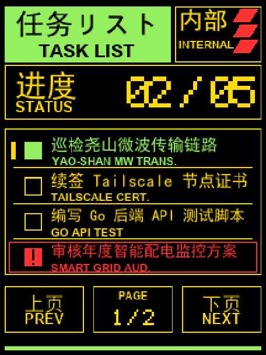

# FoloToy Todo List (工作牌任务清单)

简体中文 | [English](#english)

一个运行在 **FoloToy AI Passport**(ESP32-C3 工作牌)上的特殊风格 Todo List
固件 + Cloudflare Worker/D1 或 Docker 服务端。开机先进入本地任务清单,联网后和
云端 API 同步,右侧三颗物理按键可本地勾选并回传服务器。



## 它做什么

- 240x320 竖屏,高对比度特殊风格:黑底 + 荧光绿 `#95EF5E` + 黄 `#FFDC00` + 红 `#FF3232`,全部直角矩形,无圆角无阴影。
- 顶部荧光绿标题块:双语 **任务リスト / TASK LIST**;右侧 **INTERNAL** 黄框 + 红色斜线装饰。
- 状态面板:左侧双语 **STATUS / 任务进度**,右侧 5x7 点阵大数字 `02 / 05`(已完成/总数)。
- 任务区:每页 4 行,每行中文主标题 + 英文副标题,黄色分隔线。状态以颜色区分:
  - 已完成 → 绿色实心方框 + 绿字
  - 未完成 → 黄色空心方框 + 黄字
  - 紧急   → 红色警示图标 + 红框红字
- 服务器动态任务使用 12 px 1 bpp 常用中文字体，覆盖约 7,400 个 GB2312 字符和
  ASCII；从 Web/API 写入的常用中文可直接显示。
- 底部导航:上页/PREV、PAGE 1/2、下页/NEXT 直角黄框,页码用点阵数字。
- 底部荧光绿横条收尾。
- Cloudflare Worker API 支持增删改查、完成/重开、软删除、长轮询事件、设备状态上报。
- 服务端带一个极简特殊风格 Web 前台,可直接在浏览器里管理任务；前台的 `AI SKILL` 按钮会复制当前服务的 Skill 文档，也可直接访问 `/skill.md` 下载。文档说明 `ADMIN_TOKEN`（AI/管理）和 `DEVICE_TOKEN`（设备同步）的配置与权限，不包含真实 token。

## 按键操作(右侧三键)

| 按键 | 操作 |
| --- | --- |
| UP / DOWN 短按 | 在当页任务行间移动光标(左侧黄色光标条) |
| UP 长按 | 上一页(PREV) |
| DOWN 长按 | 下一页(NEXT) |
| OK 单击 | 勾选 / 取消当前任务,绿色实心;紧急任务勾选后转已完成 |
| OK 双击 / 长按 | 暂未绑定(可自行扩展) |

翻页为机械式硬切换(无滑动动画),进度与页码只做局部刷新。

## 云端同步

固件启动后先显示内置任务,Wi-Fi 连接成功后立即请求一次 /sync,随后进入低开销的
长轮询 /events + 周期 /sync 模式:

- 本地优先:OK 勾选任务会立刻刷新屏幕,并把 mutation 放入内存队列。
- 远程下发:Web/API 新增、修改、删除任务后,徽章通过长轮询发现版本变化并拉取全量活跃任务。
- 状态上报:徽章首次同步后立即 /report,之后每隔 TODO_REPORT_EVERY_N_SYNCS 次同步上报 Wi-Fi RSSI、任务总数、完成数和本地版本。

## 设备配网与本地设置

设备屏幕末尾的 `SETTINGS` 项进入状态页。第 1 页显示 Wi-Fi、设备 IP、`CF OK` 云端状态和本地 Web 服务；第 2 页显示云端主机、API 路径、端口和 DHCP/静态模式；第 3 页显示配对 AP 信息。设置页使用实体按键短按 UP/DOWN 切页，长按 OK 返回。每页的状态值都使用短字段，适配 240px 宽度。

首次配网或 Wi-Fi 连续连接失败时，设备会创建开放配对热点，热点地址固定为 `192.168.192.1`，并通过 DHCP 给手机/电脑分配地址。连接热点后打开 `http://192.168.192.1/`，填写 Wi-Fi SSID、密码、DHCP 或静态 IP、云端 API 地址、端口和设备 Token，保存后设备自动重启。

设备成功加入局域网后，同一配置页也可通过 `http://<设备IP>/` 打开，端口固定为 `80`。配置保存到 ESP32 NVS，不由服务端保存 Wi-Fi 凭据。Cloudflare HTTPS 使用动态 TLS 缓冲，以适配 ESP32-C3 的可用 RAM。
- Wi-Fi 只写在固件本地 main/firmware_private.h;Cloudflare 服务端不保存 Wi-Fi SSID 或密码。
- 云端只保存 Todo 数据、设备同步版本和设备报告。

## 硬件目标

| 项 | 值 |
| --- | --- |
| 主板 | FoloToy AI Passport |
| MCU | ESP32-C3(无 PSRAM) |
| Flash | 8 MB |
| 屏幕 | ST7789P3,240x320,RGB565,竖屏 |
| 按键 | UP / DOWN / OK(单 ADC 分压) |

板级支持包 `components/bsp` 来自 [folotoy/ai-passport](https://github.com/folotoy/ai-passport) 与 [FoloToy 播放器参考工程](https://github.com/PhoenixZHC/FoloToy-EVA-musicplayer),未修改硬件定义;
本仓库只把应用从"音乐播放器"换成了"任务清单"。

## 构建与烧录

需要 ESP-IDF 5.5.x(已在 5.5.3 验证)。

```powershell
# 生成本地私有配置(文件已被 .gitignore 忽略)
cd server
npm run secrets:init -- --wifi-ssid "your-wifi-ssid" --wifi-password "your-wifi-password"
cd ..

# 首次
idf.py set-target esp32c3
idf.py build

# 烧录(串口号按实际修改)
idf.py -p COM13 flash monitor
```

生成物:应用固件 `build/FoloToy-EVA-Todo.bin`,分区表 4MB factory 槽位。

> 构建无需额外字体:默认界面文字已预渲染并提交在 `main/todo_text_assets.c`。
> 想改文案/字体才需要跑 `tools/prepare_todo_text.py`(见 [docs/ASSET_PREPARATION.md](docs/ASSET_PREPARATION.md))。

## 服务端部署

服务端支持两种部署方式,两者实现同一套 `/api/v1` API,固件和 AI Skill 无需区分后端类型。

### 方式一: Cloudflare Worker + D1

服务端位于 `server/`,适合公网访问和免服务器运维。部署前先准备本地 secrets:

```powershell
cd server
npm install
npm run secrets:init
$env:CLOUDFLARE_API_TOKEN = "<your-cloudflare-api-token>"
npm run deploy:full
```

`deploy:full` 会创建/复用 D1 数据库 `eva_todo_db`,回填 `server/wrangler.toml`
的 `database_id`,应用远程迁移,上传 `ADMIN_TOKEN` / `DEVICE_TOKEN` Worker Secrets,
部署 Worker,并把部署后的 `/api/v1` 地址写入本地 `main/firmware_private.h`。

API 文档见 [docs/API.md](docs/API.md)。AI 代理控制 Skill 在
`skills/eva-todo-control/`。

### 方式二: Docker 自托管 Go 服务

`server-go/` 提供与 Cloudflare 版本兼容的轻量 Go 服务,适合私有局域网或自行部署
到公网服务器。数据保存在挂载的 `server-go/data` 目录,重启容器不会丢失任务:

```powershell
cd server-go
Copy-Item .env.example .env
# 编辑 .env,设置 ADMIN_TOKEN 和 DEVICE_TOKEN
docker compose up -d --build
```

默认 API 地址为 `http://localhost:8080/api/v1`,管理页面为 `http://localhost:8080/`,
Skill 下载地址为 `http://localhost:8080/skill.md`。公网部署时请在反向代理后启用 HTTPS。
设备配置中的云端 API 地址填写对应后端的 `/api/v1` 地址,并使用该后端的
`DEVICE_TOKEN`;管理网页和 AI 使用 `ADMIN_TOKEN`。两种部署可以分别运行,不要让同一设备
同时指向两个服务。

## 工程结构

```text
components/bsp/    板级支持:显示 / LVGL / 按键 / I2C(沿用参考工程,含音频与电量计驱动)
main/
  main.c                启动:显示 + LVGL + 按键 -> 进入 Todo 应用
  todo_app.c            界面布局、行渲染、按键映射、局部刷新
  todo_model.c          纯任务数据模型(勾选/计数/分页,主机可测)
  todo_dotfont.c        5x7 点阵字体("02 / 05" 与页码)
  todo_text_assets.c    预渲染中英文字位图(生成,勿手改)
tools/                  文字位图与界面预览生成器
tests/                  主机侧测试(模型 / 点阵)
docs/                   文档与 UI 预览
```

架构与性能设计见 [ARCHITECTURE.md](ARCHITECTURE.md)。

## 主机测试

```powershell
cc -std=c11 -Wall -Wextra -Werror -Imain tests/test_todo_model.c main/todo_model.c -o build_test_todo_model.exe
cc -std=c11 -Wall -Wextra -Werror -Imain tests/test_todo_dotfont.c main/todo_dotfont.c -o build_test_todo_dotfont.exe
./build_test_todo_model.exe
./build_test_todo_dotfont.exe

# 生成 / 校验文字资源
python tools/prepare_todo_text.py
python tests/test_todo_text_assets.py
```

## 免责声明

这是一个社区风格示例固件,第三方商标与字体不随 MIT 许可授予,分发前请自行确认
资源权利(详见 [NOTICE.md](NOTICE.md))。

---

## English

A distinctive, offline-first **Todo List** firmware for the **FoloToy AI Passport**
(ESP32-C3 badge with a 240x320 display and three physical buttons). It boots
straight into the todo screen.

- High-contrast palette: black, neon green `#95EF5E`, yellow `#FFDC00`, red `#FF3232`; sharp-cornered rectangles only.
- Bilingual header `TASK LIST / 任务列表` on a green block + `INTERNAL` box with red slash decoration.
- `STATUS / 任务进度` panel with a large 5x7 dot-matrix `02 / 05` progress counter.
- Four task rows per page, each bilingual, with green filled / yellow hollow / red urgent checkboxes.
- Bottom `PREV | PAGE 1/2 | NEXT` navigation.
- Controls: UP/DOWN short press moves the cursor, long press flips pages, OK toggles the selected task.
- Everything is pre-rendered bitmaps + 5x7 dot font: no runtime fonts, dirty-rectangle partial refresh only.

Build with ESP-IDF 5.5.x (`idf.py set-target esp32c3 && idf.py build`).

[folotoy/ai-passport]: https://github.com/folotoy/ai-passport
[PhoenixZHC/FoloToy-EVA-musicplayer]: https://github.com/PhoenixZHC/FoloToy-EVA-musicplayer

### Server deployment

The server has two deployment options with the same `/api/v1` contract, so the
firmware and AI Skill work with either backend.

1. **Cloudflare Worker + D1**: run `npm install`, create local secrets with
   `npm run secrets:init`, set `CLOUDFLARE_API_TOKEN`, and run
   `npm run deploy:full` from `server/`. This option is suited to public access.
2. **Docker self-hosted Go server**: run `Copy-Item .env.example .env`, set
   `ADMIN_TOKEN` and `DEVICE_TOKEN` in `server-go/.env`, then run
   `docker compose up -d --build` from `server-go/`. The default API is
   `http://localhost:8080/api/v1`, and persistent data is stored in `server-go/data`.

See [docs/API.md](docs/API.md) for endpoint details. Use the selected backend's
`/api/v1` URL and its `DEVICE_TOKEN` in the device configuration.

